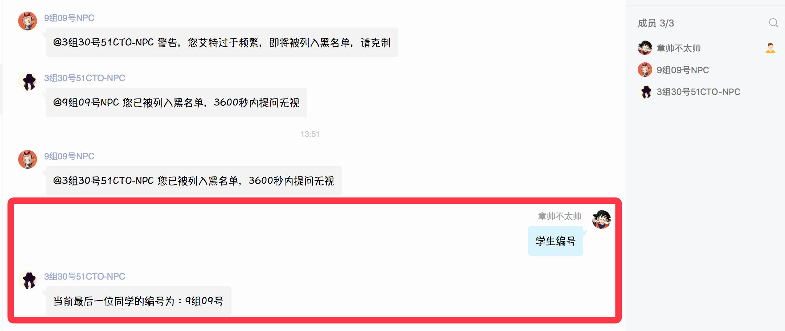

# NPC 使用说明

以 Mojo-Webqq-Docker 为基础，具备 smartreply 和 openqq 等功能的 NPC。

**~~由于腾讯接口限制，NPC 每次扫码登录只能维持在线48小时以内，若出现超时、掉线或网络异常，需重新扫码登录（若配置了邮件发送，会发送最多10次二维码邮件进行通知）。~~**

**现已支持并默认使用用户名密码登录。**

## Mojo::Webqq项目地址:
[Mojo::Webqq](https://github.com/sjdy521/Mojo-Webqq)  
感谢[灰灰](https://github.com/sjdy521)的倾情付出。

## 包含功能

1. 智能回复消息；
2. 代码测试功能；
3. 群管理功能（入群提醒，退群提示，改名通知等）；
4. 定时发送消息；
5. 自定义回复消息；
6. 习题发送及定期回顾功能。
7. 学生分组记录功能。

## 使用前提

需要自行安装 docker 运行环境。

## 简单使用

简单使用不需要配置数据库，克隆代码后，修改 build.sh 里面的相关内容，设置二维码发送的邮箱信息（以便账号密码无法登录时能尝试二维码登录）及 QQ 登录的密码：

```bash
# 运行的QQ账号
QQ_ACCOUNT="2774984XXX"
# 运行的QQ密码
QQ_PASSWD="ABCD" 
# 邮箱服务器地址
SMTP_SERVER="smtp.qq.com" 
# 邮箱服务器端口
SMTP_PORT="465" 
# 邮件来源
SMTP_FROM="2774984XXX@qq.com" 
# 发送到的邮箱
MAIL_TO="hzz1989@XXX.com" 
# 邮箱服务器账号
SMTP_USER="2774984XXX" 
# 邮箱服务器密码，QQ邮箱需要填授权码
SMTP_PASSWD="rwkbsbruwqhldXXX" 
```

* 邮箱信息只是在账号密码无法登录时能尝试二维码登录而配置，非必填。
* 若账号密码无法登录，设定 MAIL_TO 的邮箱会收到一封包含的二维码邮件，用 手机QQ 提前登录需要变成 NPC 的 QQ，尝试扫码登录。

更改完成后创建镜像并运行即可：

**依赖镜像下载时较慢，建议添加 docker 加速器后执行，比如 DaoCloud 的加速器：https://www.daocloud.io/mirror 。**

```bash
bash build.sh run
```

* 简单使用方式只包含前3个功能，后面的功能需依托数据库配置。

## 数据库配置

NPC_DATABASE 镜像运行后，会出现如下几张表：

`Crontab`：配置定时任务，配合脚本可实现若干功能；
`Information`：信息发送，用于配置定时发送消息的功能；
`KnowledgeBase`：知识库，用于配置触发回复的 key 和value；
`LinuxQuestion`：习题库，用于配置练习题以便定时发送。

### 定时信息发送

定时信息发送主要是实现定时向某些QQ群发送消息，以达到定时通知的功能。

`Information` 表配置示例如下：

| id | time | gnumber | gname | message | stat | comment |
| --- | --- | --- | --- | --- | --- | --- |
| 214 | "10 16 * * 1,3" | 361531XXX | 全国版本 | 童鞋们，充饭卡的时间到啦！ :) | 1 | WEG |

**`Information` 表各字段含义如下：**

`id`：唯一，无实意；

`time`：发送时间，crontab 的格式；

`gnumber`：需要发送的群号码；

`gname`：需要发送的群名称；

`message`：发送的信息；

`stat`：状态：1，生效；0，失效；

`comment`：备注。

### 知识库配置

通过设定 key 和 value，以实现 NPC 接受到关键字后，回复相关内容。

**`KnowledgeBase` 表配置示例如下：**

| id | gname | key | value | stat | comment|
| --- | --- | --- | --- | --- | --- |
| 60 | 全国版本 | wifi密码 | abcd!6789 | 1 | WEG |
| 61 | `__全局__` | ID84 | 84-陕西-DB1 | 1 | WEG |

**`KnowledgeBase` 表各字段含义如下：**

`id`：唯一，无实意；

`gname`：关键字触发的群名称，当群名称设定为 `__全局__` 时，所有群都生效；

`key`：关键字；

`value`：回复的信息；

`stat`：状态：1，生效；0，失效；

`comment`：备注。

**需要注意的是，此功能需配合 [定时任务功能](https://github.com/huangzhongzhang/NPC#定时任务功能) 使用，定时将数据写入指定文件方可生效。**

### 习题库配置

设定习题，定时发送习题及答案，给有需要的童鞋。

效果预览：


**`LinuxQuestion` 表配置示例如下：**

| id | date | question | answer | stat |
| --- | --- | --- | --- | --- |
| 125 | 2018-01-10 | 简述Linux文件系统通过i节点把文件的逻辑结构和物理结构转换的工作过程。 | i节点是一个64字节长的表，表中包含了文件的相关信息，其中有文件的大小、文件所有者、文件的存取许可方式以及文件的类型等重要信息。在i节点表中最重要的内容是磁盘地址表。在磁盘地址表中有13个块号，文件将以块号在磁盘地址表中出现的顺序依次读取相应的块。Linux文件系统通过把i节点和文件名进行连接，当需要读取该文件时，文件系统在当前目录表中查找该文件名对应的项，由此得到该文件相对应的i节点号，通过该i节点的磁盘地址表把分散存放的文件物理块连接成文件的逻辑结构。 | 1 |
| 126 | 2018-01-11 | 系统管理员的职责包括那些？管理的对象是什么？ | 系统管理员的职责是进行系统资源管理、设备管理、系统性能管理、安全管理和系统性能监测。管理的对象是服务器、用户、服务器的进程及系统的各种资源等。 | 1 |

**`LinuxQuestion` 表各字段含义如下：**

`id`：唯一，无实意；

`date`：发送习题的日期（每日一练）；

`question`：问题；

`answer`：答案；

`stat`：状态，是否已写入 `KnowledgeBase` 表（以实现习题回顾的功能）：1，已写入；0（默认），未写入；

**需要注意的是，此功能需配合 [定时任务功能](https://github.com/huangzhongzhang/NPC#定时任务功能) 使用，使得习题可以定时发送。**

### 定时任务功能

若要实现 `自定义回复消息` 以及 `习题发送及定期回顾功能` ，我们需要配置 `Crontab`
定时任务。

**`Crontab` 表示例如下：**

| id | time | command | stat | comment |
| --- | --- | --- | --- | --- |
| 1 | */10 * * * * | cd /root;bash -x set_knowledge.sh &> /dev/null | 1 |
| 2 | 18 09 * * 1-5 | cd /root;bash -x send_linux_questions.sh "51CTOLinux微职位-精英 51CTO学院Linux微职位" "question" &> /dev/null | 1 |
| 3 | 38 09 * * 1-5 | cd /root;bash -x send_linux_questions.sh "51CTOLinux微职位-精英 51CTO学院Linux微职位" "answer" &> /dev/null | 1 |
| 4 | 08 09 * * 2-6 | cd /root;bash -x exercise_review.sh "51CTOLinux微职位-精英 51CTO学院Linux微职位" &> /dev/null | 1 |
| 5 | */5 * * * * | cd /root;bash -x count_classmates.sh &> /dev/null | 1 |

**`crontab` 表各字段解析如下：**

`id`：唯一，无实意；

`time`：发送时间，crontab 的格式；

`command`：执行的命令；

`stat`：状态：1，生效；0，失效。

**`crontab` 表各条目解析如下：**

第一条：`set_knowledge.sh`，设定知识库更新时间。

第二条：`send_linux_questions.sh "XXX" "question"`，设定发送问题的群和发送时间。**多个群可用空格间隔，故群名称不能包含有空格！**

第三条：`send_linux_questions.sh "XXX" "answer"`，设定发送答案的群和发送时间。**多个群可用空格间隔，故群名称不能包含有空格！**

第四条：`exercise_review.sh "XXX"`，设定发送练习回顾的群（前一天的问题及答案）。

第五条：`count_classmates.sh`，“学生编号”整理的功能，群内输入“学生编号”，会自动提示最后一位学员的分组和编号，便于对新同学进行分组，每10分钟刷新一次。**功能实现需要满足的条件：学员组内名称必须包含“xx组xx号”**。如图：



